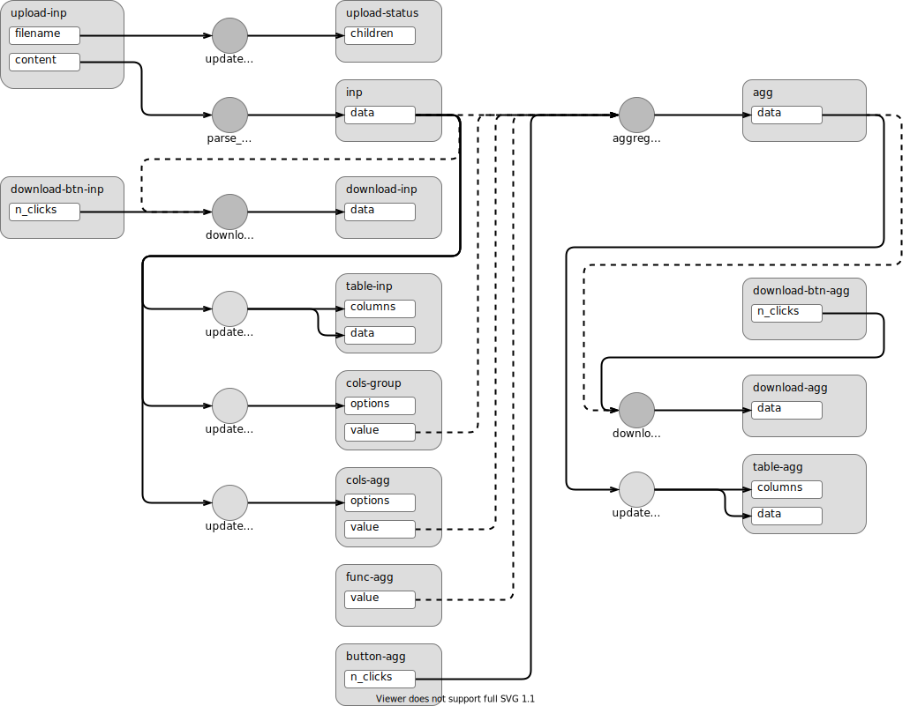
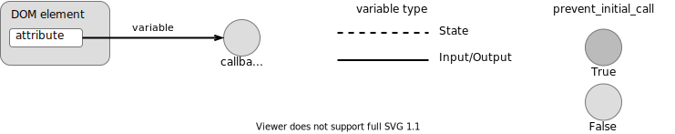

# reactivity-demo-dash

<!-- badges: start -->
<!-- badges: end -->

The goal of this repository is to show how to implement a reactive data-science app using Dash.

This is part of [*Data-Science Reactivity: Three Ways*](https://ijlyttle.github.io/reactivity-three-ways-book/), an effort to show how to make the same "app", using:

-   R: [Shiny](https://shiny.rstudio.com/)
-   Python: [Dash](https://dash.plotly.com/)
-   JavaScript: [Observable](https://observablehq.com/@observablehq/five-minute-introduction)

## Aggregate: local

There's a [deployed version](https://aggregate-local.herokuapp.com) of this app.





## RStudio Cloud

If you are running this from Ian's RStudio Cloud Project, there will be a package available called `rscloud.dash.py`.
It has a single function, `run_dash_app()`, which helps us launch Dash from RStudio Cloud.

From the root of the project, at the R console:

```r
library("rscloud.dash.py")
run_dash_app("app-aggregate-local.py", venv = "venv")
```

It will launch the browser, then the app. 
The browser will say "Connection Refused"; don't worry, wait a few seconds then reload.

You can stop the Dash app from the R console.
